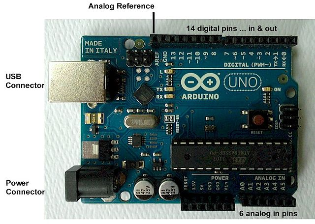

# power-switch
How to turn on/off PC by just switching on/off the button on power extension cord with switch

## Introduction
I would like to be able to turn on/off PC by just switching on/off the button on power extension cord with switch:

Turning on is simple - just switch on the power extension switch !
... the issue is with turning off - all PCs needs some time to shut down properly This idea is similar to the way how UPS communicates with PC in case of power failure.

## General concept
- arduino will be used as central unit
- arduino will control the relay module which will power PC
- arduino will be connected to mains by power adapter and to PC with USB
- power cord switch will switch on/off the arduino power adapter and not the PC
- arduino will auto-select the power source between power adapter and USB
- arduino will be responsible for showing current boot sequence status of the PC (turning on, turning off, switched off).

## How does it work ?
### Turning PC on:
- switch on arduino's power adapter
- arduino starts and by default sets relay in ON mode and PC boots up
- arduino sets RGB LED to "red blink" mode
- PC boots up and when fully started sends message to arduino to set RGB LED in "solid green" mode
### Turning PC off (this is tricky part):
- switch off arduino's adapter using button on extension cord
- arduino switches itself to USB power source using built into board auto-select functionality
- arduino "senses" that power adaptor is switched off
- arduino sets RGB LED to "red blink" mode
- arduino sends message over USB to PC ordering PC to enter shut down sequence
- PC receives the message and enters shut down sequence, in the process of running shut down scripts PC sends following command to arduino:
  - set RGB LED to "red blink" mode
  - set RGB LED to "off" mode after 55 seconds
  - set relay in "off" mode after 60 seconds
- arduino receives message and sets RGB LED TO "red blink" mode
- arduino after 55 seconds sets RGB LED to "off" mode
- arduino after another 5 seconds switch relay to "off" mode - at this point whole system (PC and arduino) is completely disconnected from mains

## Modules

There are 3 elements which had to be implemented:

- software
  - listener on PC to intercept the shut down message from arduino
  - software running on micro controller to monitor current power source
- hardware
  - device to monitor power source for arduino
  - relay to drive power for PC
  - led to show current status of the power switch and PC

## Software implementation details
### PC listener
This is code running on PC which is responsible for listening on the shut down message from arduino. This code is written in Python and is based on infinitive loop which listens on data from serial. Code was tested on Debian Squeezy.
### Linux init scripts
This script is responsible for setting up, initiating and controlling arduino from PC at star up and shut down of the system. Code was tested on Debian Squeezy.
### Arduino code
This code is responsible for controlling LED and relay.
## Hardware implementation details:
Hardware is based on Arudino Uno: 

### Power source monitor
2 resistors connected between VCC/GND/A0 to intercept the switching off of power adaptor. Arduino has built in functionalit to switching between power adaptor and USB.
### Relay
Relay module.
### LED
RGB LED connected to the board over 3 few resistors.
## Communicatio between arduino and PC
In this project 2 way communication between arduino and PC was implemented. Each message starts from command id - *integers number*, this number might be in most cases followed by *delay* parameter which means that command should be executed in *N* milliseconds after the command was sent, and in some special cases message can also contain some *additional load* (TODO for LCD). Each command must end with semicolon *;* character and after that *ENTER* character.

- PC (server) to Arduino command list

First Header  | Second Header
------------- | -------------
Content Cell  | Content Cell
Content Cell  | Content Cell